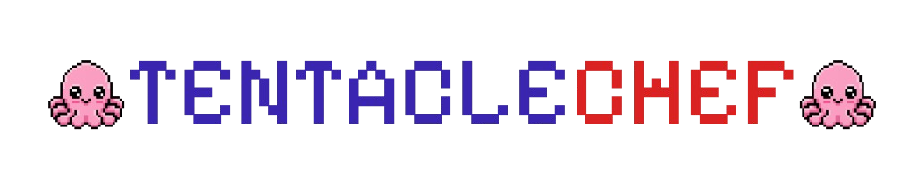
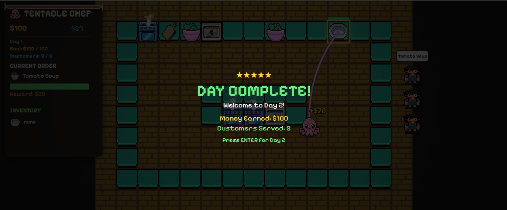
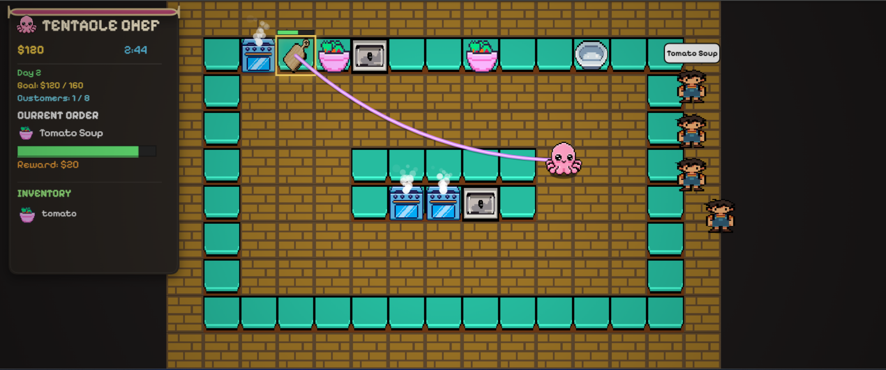
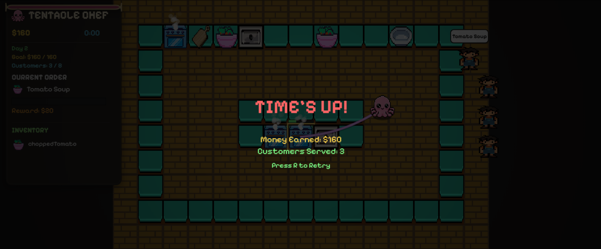

# Tentacle Chef!

> 3 Minutes is all you have. Cook, serve, and survive the rush as an octopus chef. Complete orders, earn money, and serve customers to proceed to increasingly harder days!

<p align="center">
  
</p>

---

## Overview

I created and built this project for [Horizons | Hack Club](https://horizons.hackclub.com/app)

Tentacle Chef is a cozy pixel style 2D game where you play as an octopus chef. Each session, you have 3 minutes to reach as many days as you can. You earn money by fulfilling orders and serving customers! As the days progress, the difficulty level also increases.

---

## Motivation

Growing up, I was always intrigued and fascinated by cooking games. I still remember playing Overcooked with my mother and having the time of my life! I tried creating a similar cooking game to sort of relive that overall experience and nostalgia.

---

## Screenshots

<p align="center">
  
  <br>
  <em>Day Completed!</em>
</p>

<p align="center">
  
  <br>
  <em>Gameplay screenshot.</em>
</p>

<p align="center">
  
  <br>
  <em>Time's Up!</em>
</p>

---

## Tech Stack

| Category | Tech used |
|----------|--------------|
| Language | TypeScript |
| Frontend | HTML5 Canvas |
| Build Tool | Vite |
| Graphics | Pixel Art (Piskel) |
| Audio | HTML5 Audio API |
| Version Control | Git + GitHub |
| Deployment | Vercel |

---

## How It Works

> ⚠️ NOTE: At the time of submission, I have made a prototype version of Tentacle Chef and am looking forward to add more recipes, customers, maps amd levels once the project gets approved!

The gameplay revolves around a simple cooking loop:

1. Customers join the queue and place orders.
2. The player moves around the kitchen and cook orders.
5. Successfully serving dishes rewards money.
6. Completing the day's objectives unlocks the next day with higher difficulty.


 Controls

| Key | Action |
|-----|--------|
| W A S D | Move |
| ENTER | Start Next Day |
| R | Restart after Time Up |

---

## How to Run?

### Prerequisites

- Node.js (v18 or later)
- npm

### Installation

Clone the repository:

```bash
git clone https://github.com/rawrrudy/tentacle-chef.git
```

Navigate into the project directory:

```bash
cd tentacle-chef
```

Install dependencies:

```bash
npm install
```

Start the development server:

```bash
npm run dev
```

Open your browser and visit:

```
http://localhost:5173
```

### Build for Production

To create an optimized production build:

```bash
npm run build
```

To preview the production build locally:

```bash
npm run preview
```

## Future Improvements

- Multiple recipes
- New ingredients
- Kitchen upgrades
- Power ups
- New maps

---

## Acknowledgement

I would like to thank the entire team at [Horizons | Hack Club](https://horizons.hackclub.com/app) for conducting such a fun experience! 
